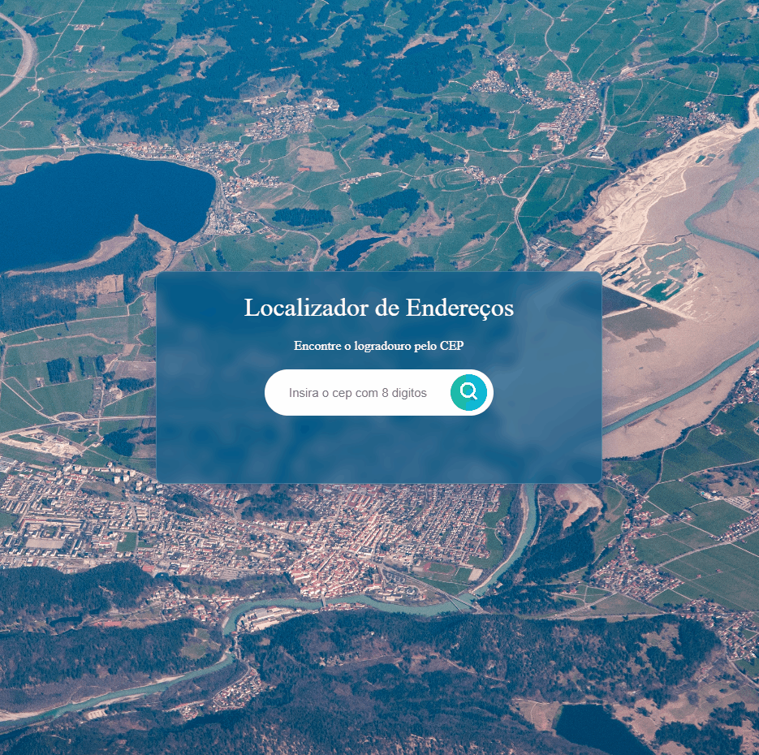
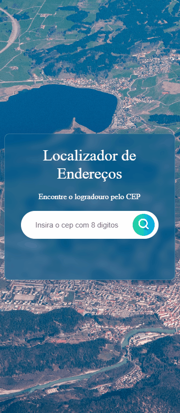

# Localizador de Endereços

## Sumário

- [Sobre o projeto](#sobreoprojeto)
- [Layout  desktop](#layout-desktop)
- [Tecnologias utilizadas](#tecnologias-utilizadas)
- [O que eu aprendi](#o-que-eu-aprendi)
- [Acesso a página](#acesso-a-página)

## Sobre o projeto

Esse projeto apresenta  uma solução simplificada e eficiente para a busca de endereços. Ao inserir o CEP desejado, a aplicação responde instantaneamente, fornecendo informações precisas do endereço correspondente. Há verificações inteligentes para campos vazios e CEPs inválidos, garantindo uma experiência sem falhas e altamente eficaz.  Facilitando a vida dos usuários, oferecendo uma solução rápida e acessível para encontrar informações de endereços de forma intuitiva.
 
 

## Layout desktop    

 

 
 
 

## Layout Mobile    

 

 
 

## Tecnologias utilizadas

- HTML
- CSS
- JS

## O que eu aprendi

Neste projeto pude aprimorar meus conhecimentos em integração com uma API e com usabilidade. As validações  para campos vazios e CEPs inválidos me proporcionaram colocar em prática a lógica e observar a importância da garantia de dados precisos e da experiência do usuário livre de erros.

## Acesso a página

Para ver o projeto pronto [clique aqui ](https://claricassia.github.io/Gerador-de-conselhos/)